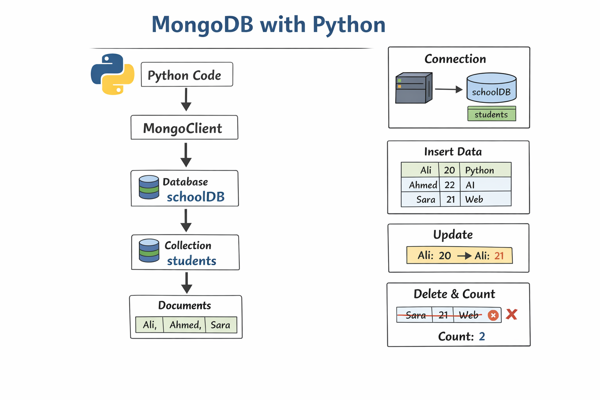
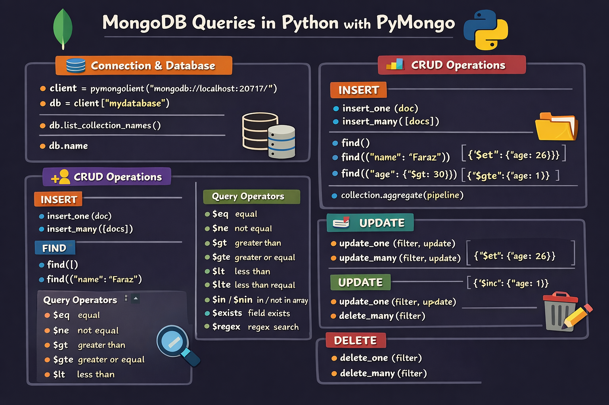

# MongoDB Tutorial for Students

Welcome to the MongoDB tutorial repository! This collection of Jupyter notebooks provides hands-on learning materials for MongoDB database operations using Python's PyMongo library.

## Repository Contents

This repository contains two main Jupyter notebooks and helpful diagrams:

### 1. MongoDBClass.ipynb
A comprehensive tutorial covering all aspects of MongoDB operations:
- Environment setup and PyMongo installation
- MongoDB Atlas connection
- Database and collection creation
- CRUD operations (Create, Read, Update, Delete)
- Advanced querying techniques
- Indexing and performance optimization
- Practical exercises with realistic examples



### 2. student.ipynb
A simplified notebook focused on core MongoDB operations:
- Connecting to MongoDB server
- Basic database and collection operations
- Document insertion (single and multiple)
- Document querying and filtering
- Update operations (single and multiple)
- Delete operations
- Query operators examples



## Prerequisites

Before starting with these tutorials, ensure you have:

1. **Python 3.x** installed on your system
2. **Jupyter Notebook** installed (`pip install jupyter`)
3. **PyMongo** library installed (`pip install pymongo`)
4. **MongoDB Atlas account** (free tier available) or local MongoDB installation

## Setup Instructions

### Step 1: Clone or Download the Repository
```bash
git clone https://github.com/yourusername/mongodb-tutorial.git
```

### Step 2: Navigate to the Project Directory
```bash
cd mongodb-tutorial
```

### Step 3: Install Dependencies
```bash
pip install pymongo jupyter
```

### Step 4: Launch Jupyter Notebook
```bash
jupyter notebook
```

### Step 5: Configure MongoDB Connection
1. Sign up for a free MongoDB Atlas account at [https://www.mongodb.com/atlas](https://www.mongodb.com/atlas)
2. Create a cluster and get your connection string
3. In the notebook, replace `"REPLACE_WITH_YOUR_MONGODB"` with your actual MongoDB connection string
4. Make sure to update the username and password in the connection string

Example connection string format:
```
mongodb+srv://<username>:<password>@<cluster-name>.mongodb.net/
```

## Learning Path

### For Beginners:
Start with `student.ipynb` to understand basic MongoDB operations before moving to the more comprehensive `MongoDBClass.ipynb`.

### For Intermediate Learners:
Work through `MongoDBClass.ipynb` which covers advanced topics and practical examples.

## Key Topics Covered

- **Connecting to MongoDB**: Establishing connections to MongoDB Atlas or local instances
- **CRUD Operations**:
  - Create: `insert_one()` and `insert_many()`
  - Read: `find()` and `find_one()` with various filters
  - Update: `update_one()` and `update_many()` with operators
  - Delete: `delete_one()` and `delete_many()`
- **Query Operators**: `$gt`, `$lt`, `$gte`, `$lte`, `$in`, `$nin`, `$exists`, `$regex`
- **Advanced Features**: Sorting, limiting, counting, indexing
- **Practical Examples**: Real-world scenarios and use cases

## Important Notes

- Always keep your MongoDB connection string secure and never share it publicly
- The free tier of MongoDB Atlas has limitations on storage and operations
- Remember to close database connections when done in production code
- Use appropriate error handling in your applications

## Troubleshooting

### Common Issues:
1. **Connection Errors**: Verify your connection string and network connectivity
2. **Authentication Errors**: Check username, password, and database permissions
3. **Import Errors**: Ensure PyMongo is properly installed

### Useful Resources:
- [MongoDB Documentation](https://docs.mongodb.com/)
- [PyMongo Documentation](https://pymongo.readthedocs.io/)
- [MongoDB University](https://university.mongodb.com/) (Free courses)

## Contributing

This repository is maintained for educational purposes. If you find any issues or have suggestions for improvements, feel free to create an issue or submit a pull request.

## License

This educational material is freely available for learning and teaching purposes.